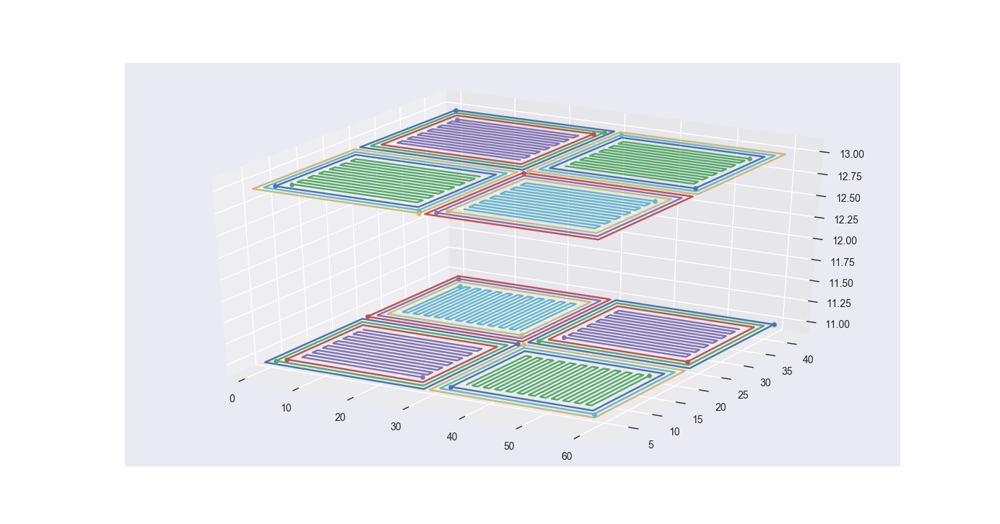

# Slicer
Generate G-code for simple path plan. This project is a subproject of Thermal Simulation Test Platform.

* 1. Contour and raster path

Boundary is denoted by black lines; contours are shown in red; raster is shown in blue. Dot denotes the start point of a subpath.

* 2. Checkerboard in 2D

Raster path in each cell has random orientation.

* 3. Checkerboard pattern in multiple layers

